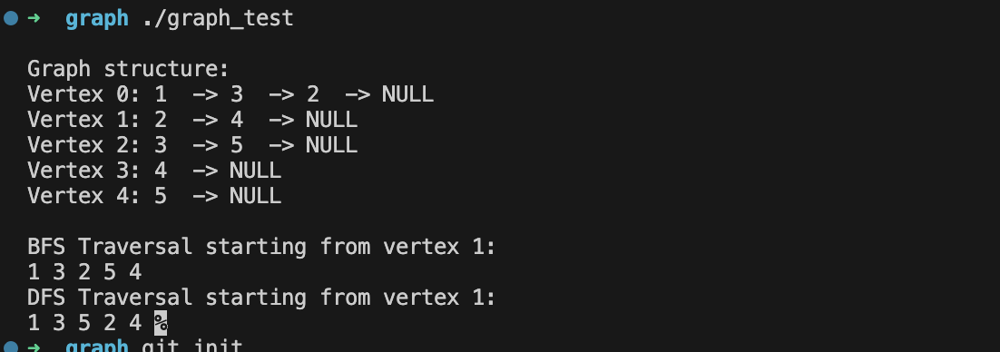

# Graph_clang


This repository contains an implementation of a Graph Abstract Data Type (ADT) in C. The graph is implemented as an adjacency list, which allows efficient traversal and manipulation of graph data.

## Features
- Graph Creation: Functionality to create a new graph.
- Vertex Insertion: Ability to insert new vertices into the graph.
- Edge Insertion: Ability to create edges between vertices.
- Depth-First Search (DFS): A recursive DFS algorithm to traverse the graph.
- Breadth-First Search (BFS): BFS algorithm implementation to traverse the graph level by level.
## Implementation Details
- The graph is represented using an adjacency list.
- Each vertex in the graph stores its data and a list of edges.
- Edges are implemented as nodes in a linked list, originating from each vertex.
## Usage
Creating a Graph:

```c

Graph g = newGraph();
``````
Adding Vertices:

```c

insertVertex(g, vertexData);
```
Adding Edges:


```c

insertEdge(g, fromVertexData, toVertexData);
```
Performing DFS:

```c

dfs(g, startVertexData, visitFunction);
```
Performing BFS:

```c

bfs(g, startVertexData, visitFunction);
```

## Compilation
Compile the source files along with your main program file. For example:

```bash

gcc -o myprogram main.c graph.c -I.
```
## Running the Tests

After compilation, run the program:

```bash

./myprogram
```




## Contributing
Contributions to this project are welcome. Please fork the repository and submit a pull request.

